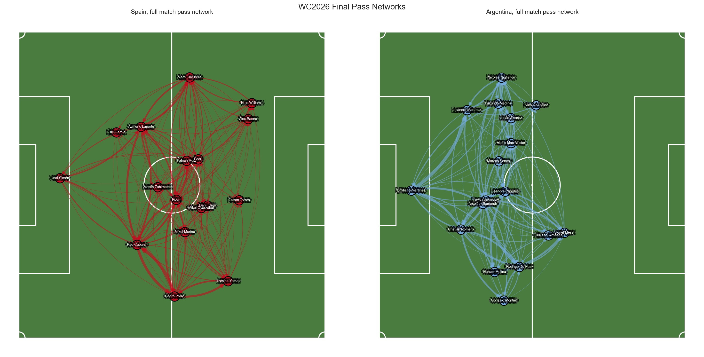
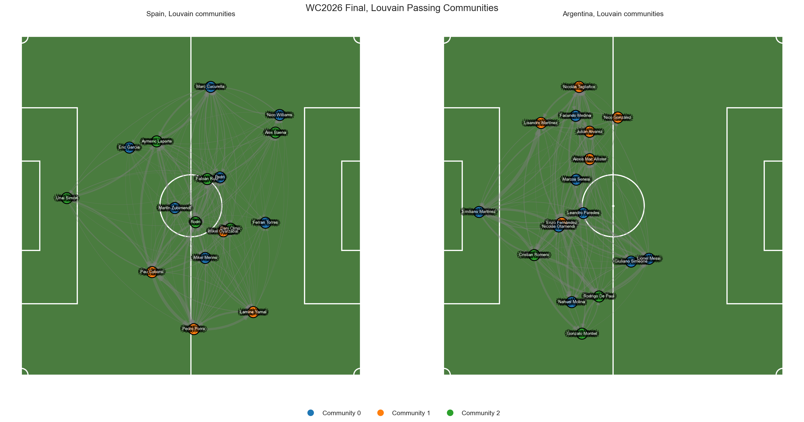
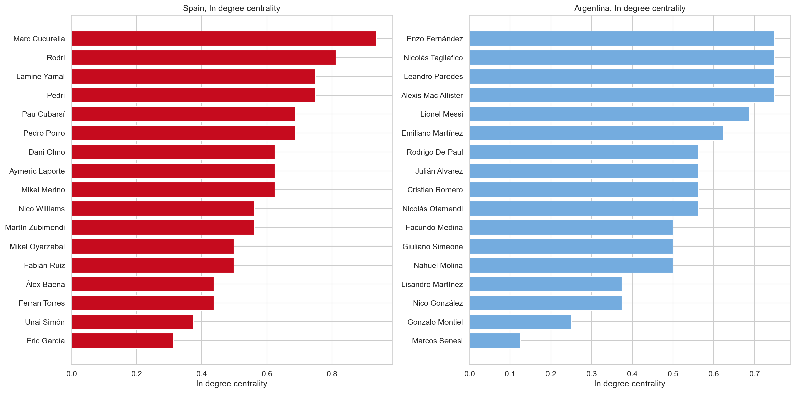
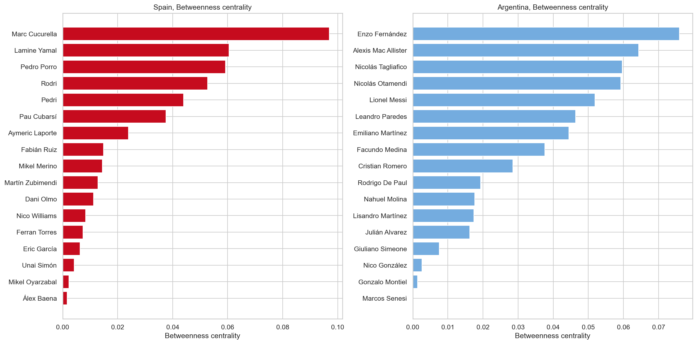
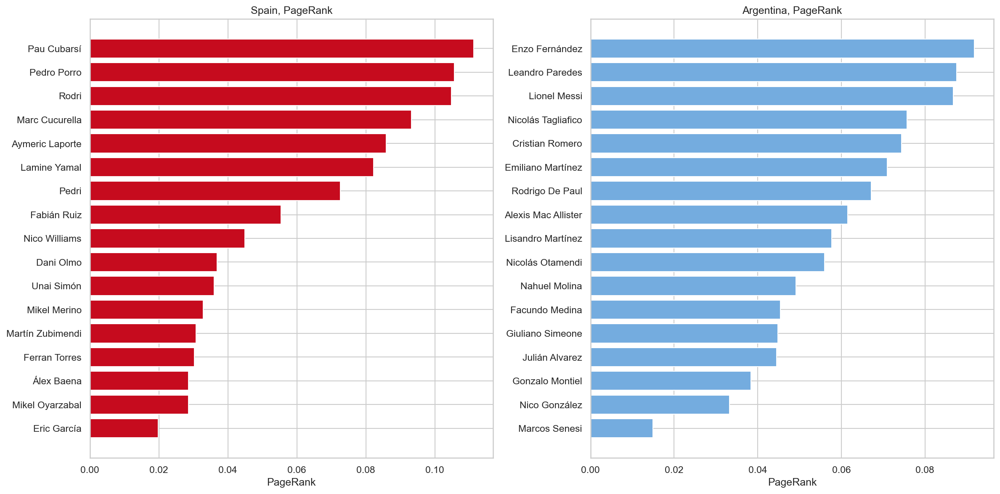
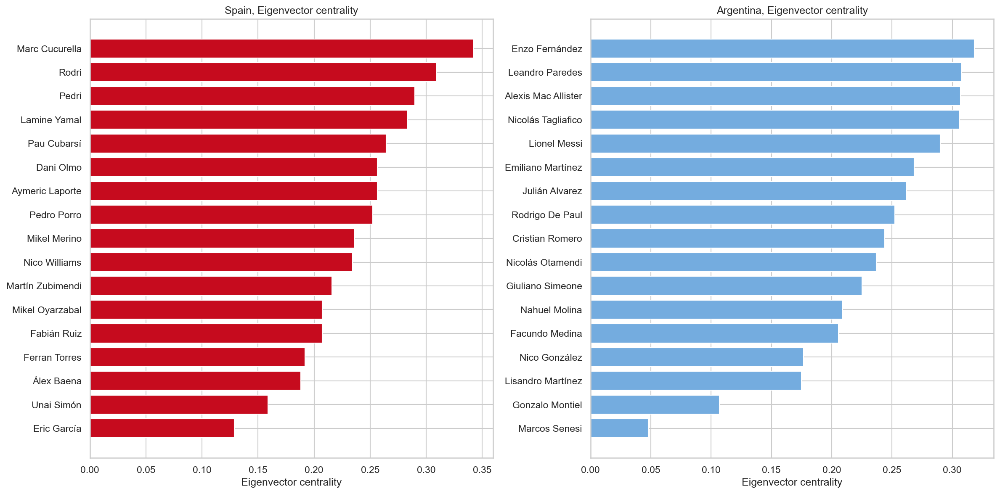
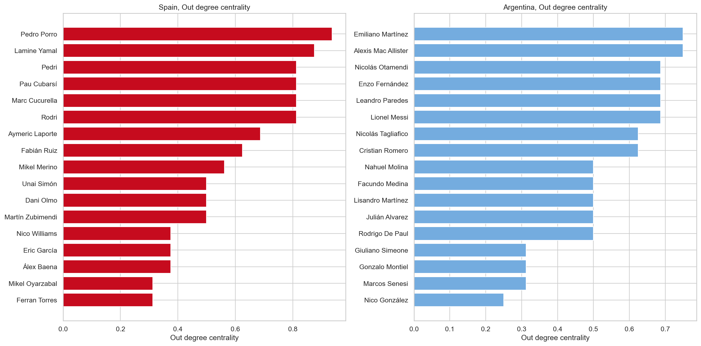
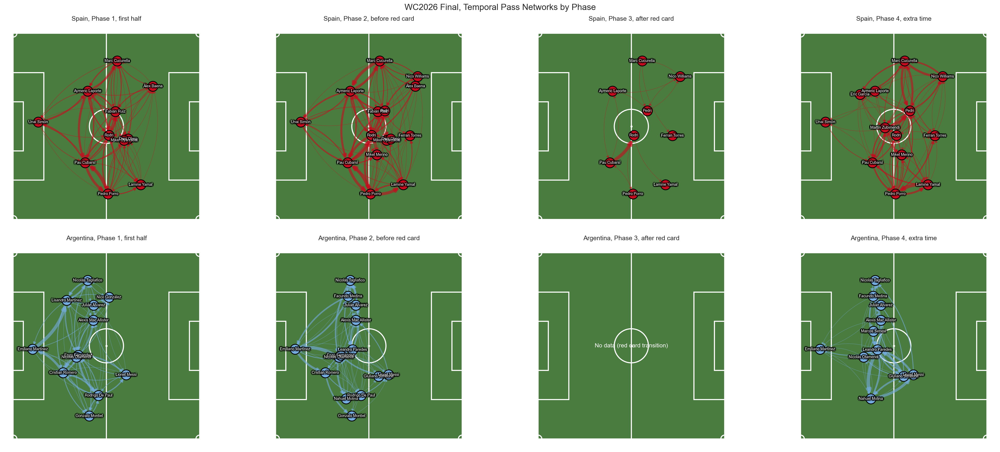
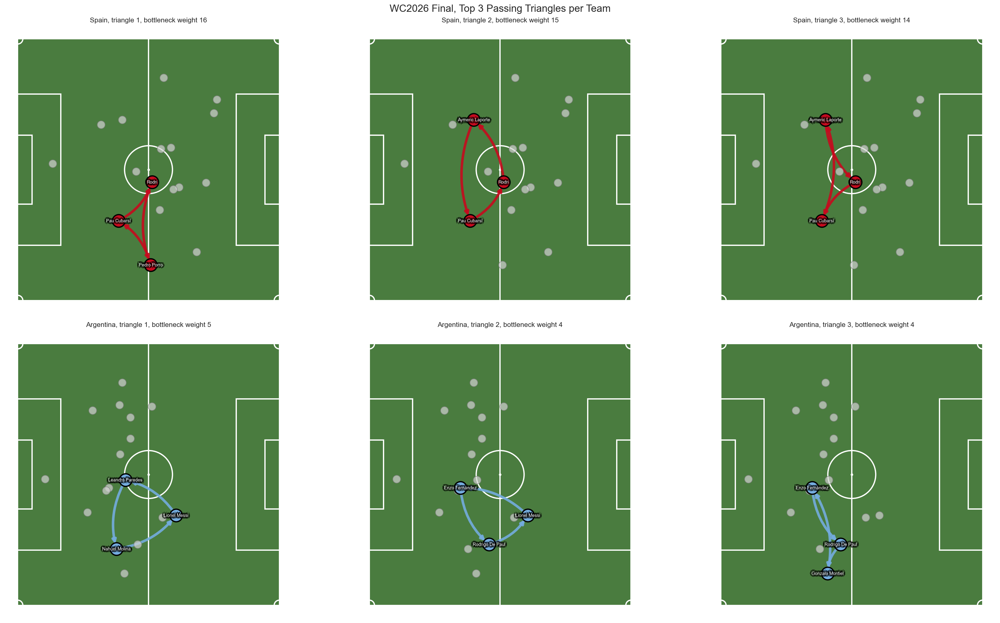
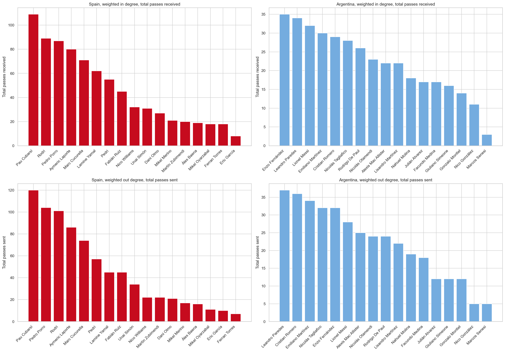

# ⚽ WC2026 Final: Pass Network Analysis
### Spain vs Argentina | July 19, 2026 | Spain wins

A Social Network Analysis of the 2026 FIFA World Cup final, built from raw match event data. Each team's passing behavior is modeled as a directed weighted graph where nodes are players positioned at their real average pitch coordinates, and edges represent completed passes weighted by frequency. The analysis covers centrality measures, temporal evolution across match phases, Louvain community detection, and directed triangle detection (A → B → C → A passing patterns).

> **Data credit:** Event data collected and curated by [Noah Bair](https://github.com/nlbair/wc2026-events), sourced from WhoScored.

---

## 🗂 Project Structure

```
Worldcup-Final-Match-Network-Analysis/
├── data/
│   ├── raw/          # Original match event CSV (1 file)
│   └── clean/        # Processed edgelist files (10 files, one per team/phase)
├── notebooks/
│   ├── 01_graph_construction.ipynb   # Builds directed weighted graphs from CSV
│   └── 02_analysis.ipynb             # Full SNA: centrality, communities, triangles
├── pics/             # All visualizations (combined and split by team)
└── README.md
```

---

## 📊 Key Findings

### Spain dominated possession across all four match phases

Node positions are not invented — they represent each player's real average pitch coordinates across every touch in the match. The visualization reveals that **Spain occupied the full pitch throughout the game**, while **Argentina was consistently pushed back toward their own goal**, particularly in extra time after the red card.

Spain also accumulated significantly more completed passes in every phase, including extra time, showing sustained ball control and more offensive opportunities throughout the 120 minutes.

---

### Centrality: Spain's most influential players

| Measure | Top Player | Interpretation |
|---|---|---|
| PageRank | **Pau Cubarsí** | Most important pass receiver, weighted by who sent him the ball |
| Betweenness | **Marc Cucurella** | Key bridge connecting different parts of Spain's passing network |
| Eigenvector | **Marc Cucurella** | Most connected to other highly connected players |
| In-degree | **Marc Cucurella** | Most sought-out receiver by volume |
| Out-degree | **Pedro Porro** | Most active ball distributor |

Cucurella's dominance across three centrality measures simultaneously suggests he was the structural anchor of Spain's midfield, not just a volume passer but a player whose removal would have fragmented the network.

---

### Passing Triangles: Spain's tactical backbone

The directed triangle detection (A → B → C → A cycles) identified the players who most consistently executed triangular combination play:

🔺 **Most frequent triangles:** Cubarsí and Rodri were the two players appearing most consistently in successful passing triangles, combining with rotating third players to maintain possession under pressure.

🔺 **Regular triangle participants:** Cubarsí, Rodri, Pedro Porro, and Aymeric Laporte formed the core of Spain's triangular passing structure, concentrating in the defensive and central midfield zones.

---

### Pitch Visualization: full match pass networks



The density of Spain's edges (left) versus Argentina's (right) is immediately visible. Spain's network is nearly fully connected with thick edges across the whole pitch, while Argentina's is thinner and concentrated centrally. This reflects Spain's positional dominance and Argentina's more reactive, compact defensive approach.

---

### Community Detection: Louvain identified 3 tactical groups in Spain



**Community 1 — The attacking corridor (Cucurella, Eric García, Zubimendi, Merino, Pedri, Nico Williams, Ferran Torres)**
This group concentrated passing flow through the left and central channels, ultimately creating the conditions for Ferran Torres to score the only goal that gave Spain the lead.

**Community 2 — The pressure unit (Cubarsí, Porro, Lamine Yamal, Oyarzabal)**
This community applied pressure on Argentina's defensive line by drawing attention to Lamine Yamal, who Argentina prioritized blocking, freeing space for the rest of the team.

**Community 3 — The structural bridge (Unai Simón, Laporte, Fabián Ruiz, Rodri, Dani Olmo, Alex Baena)**
This group acted as a connector between the other two communities. Notably, Laporte and Rodri served as the relay point for the Cucurella ↔ Cubarsí exchange, a deliberate strategy to circulate the ball and wear down Argentina's defensive shape.

---

### Centrality Measures







---

### Temporal Evolution



The four match phases (First Half, Second Half before red card, Second Half after red card, Extra Time) show how Argentina's network degraded progressively. After Enzo Fernández received a double yellow card at expandedMinute 97, Argentina's passing connections in extra time became notably sparser, reflecting the tactical disruption of playing with 10 men.

---

### Passing Triangles



---

### Degree Distribution



---

## ⚙️ How to Reproduce

1. Clone the repository
   ```bash
   git clone https://github.com/pyrawn/Worldcup-Final-Match-Network-Analysis.git
   cd Worldcup-Final-Match-Network-Analysis
   ```

2. Install dependencies
   ```bash
   pip install networkx pandas numpy matplotlib seaborn python-louvain powerlaw
   ```

3. Run `notebooks/01_graph_construction.ipynb` to build the edgelists from the raw CSV

4. Run `notebooks/02_analysis.ipynb` to reproduce all centrality measures, visualizations, community detection, and triangle analysis

All outputs are saved automatically to `data/clean/` and `pics/`

---

## 📚 References

- A. Barabási, *Network Science*. Cambridge University Press, 2016.
- A. Barabási and R. Albert, "Statistical mechanics of complex networks," *Reviews of Modern Physics*, vol. 74, pp. 47–97, 2002.
- S. Wasserman and K. Faust, *Social Network Analysis: Methods and Applications*. Cambridge University Press, 1994.
- V. D. Blondel, J. L. Guillaume, R. Lambiotte, and E. Lefebvre, "Fast unfolding of communities in large networks," *Journal of Statistical Mechanics*, P10008, 2008.
- Y. Bi et al., "Motif analysis and passing behavior in football passing networks," *Chaos, Solitons & Fractals*, 2024. [arXiv:2408.07927](https://arxiv.org/abs/2408.07927)
- Khabib Mukhtar et al., "Analyzing Football Strategy and Formation in the Manchester City vs Fulham Match Using Graph Theory," 2024. [ResearchGate](https://www.researchgate.net/publication/381514422)
- S. S. Epp, *Discrete Mathematics with Applications*, 4th ed. Cengage Learning, 2011.
- N. Bair, *WC2026 Event Data*. GitHub, 2026. [github.com/nlbair/wc2026-events](https://github.com/nlbair/wc2026-events) (data sourced from WhoScored)

---

## Acknowledgements

I would like to express my gratitude to my coordinator and professor **Didier Omar Gamboa Angulo** for the time and knowledge shared throughout the Social Networks Analysis course, as well as to his teaching assistant **José Francisco Pérez Alcocer** for providing valuable insight into football strategy and tactics. I also extend my appreciation to **PhD. Soledad Pech Couoh**, my Unsupervised Learning professor, whose lectures on clustering methods directly informed the community detection approach applied in this project. Finally, I would like to thank my sister **Belinda De Aquino Castellanos** for teaching me everything I know about football and for sparking my appreciation for the strategic depth of the game, particularly in one of my favorite national teams: Spain.

---

**Julio Cesar De Aquino Castellanos - Universidad Politécnica De Yucatán - Data 8th B - Social Network Analysis**
